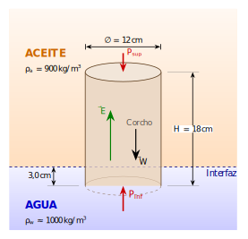
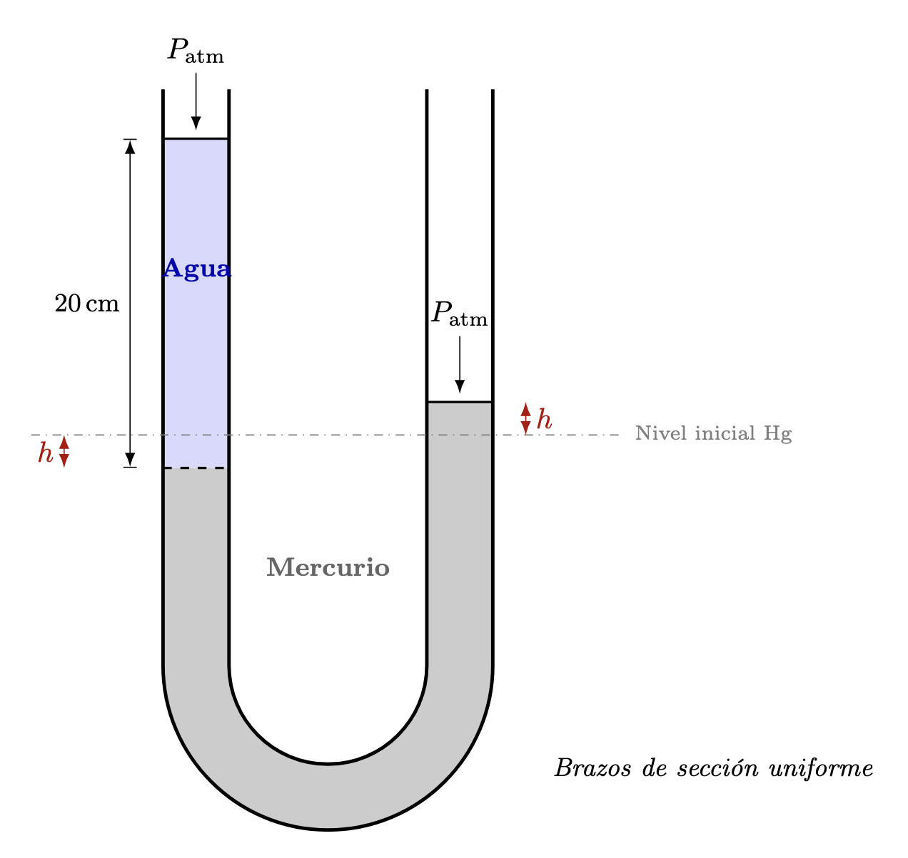

El presente material propone **seis problemas nuevos**, cada uno **análogo** a uno de los ejercicios del examen proporcionado por el usuario. La idea es conservar el mismo tipo de razonamiento físico, pero con datos distintos, de manera que el documento sirva como guía de estudio y práctica adicional.

En todos los casos, las soluciones se desarrollan de manera **detallada, paso a paso y didáctica**, enfatizando:

- la identificación de los principios físicos relevantes;
- la traducción del enunciado a ecuaciones;
- el manejo cuidadoso de unidades; y
- la interpretación física del resultado.

Cuando sea conveniente, se usarán los valores aproximados:

$$
g = 9.81\ \text{m/s}^2,
\qquad
\rho_{\text{agua}} = 1000\ \text{kg/m}^3,
\qquad
\rho_{\text{Hg}} = 13600\ \text{kg/m}^3.
$$

# Problema 1. Flotación de un cilindro en dos fluidos

## Enunciado {.unnumbered}

Un bloque cilíndrico de corcho, de **12 cm de diámetro** y **18 cm de altura**, flota verticalmente en la interfaz entre **aceite** y **agua**. La cara inferior del cilindro se encuentra **3.0 cm por debajo de la interfaz**. La densidad del aceite es

$$
\rho_{\text{aceite}}=900\ \text{kg/m}^3.
$$

Se pide determinar:

a) la presión manométrica en la cara superior del cilindro;

b) la presión manométrica en la cara inferior;

c) la masa y la densidad del cilindro.

## Esquema físico del problema {.unnumbered}

## Idea física {.unnumbered}

Este problema combina dos conceptos fundamentales de la hidrostática:

1. **Presión hidrostática.**  
   En un fluido en reposo, la presión aumenta con la profundidad según
   $$
   p=\rho g h.
   $$

2. **Principio de Arquímedes.**  
   Un cuerpo total o parcialmente sumergido experimenta un empuje vertical hacia arriba igual al peso del fluido desalojado.

En este caso, el cilindro desaloja **dos fluidos distintos**, de modo que el empuje total será la suma de los empujes ejercidos por el aceite y por el agua.

## Datos y conversión de unidades {.unnumbered}

Diámetro del cilindro:
$$
D=12\ \text{cm}=0.12\ \text{m}
$$

Radio:
$$
r=\frac{D}{2}=0.06\ \text{m}
$$

Altura total:
$$
H=18\ \text{cm}=0.18\ \text{m}
$$

Profundidad de la cara inferior bajo la interfaz:
$$
h_{\text{agua}}=3.0\ \text{cm}=0.03\ \text{m}
$$

Como la parte inferior está 3 cm dentro del agua, la longitud del cilindro sumergida en aceite es
$$
h_{\text{aceite}}=H-h_{\text{agua}}=0.18-0.03=0.15\ \text{m}.
$$

El área transversal del cilindro es
$$
A=\pi r^2=\pi(0.06)^2=0.01131\ \text{m}^2.
$$

Tomaremos además
$$
\rho_{\text{agua}}=1000\ \text{kg/m}^3,
\qquad
g=9.81\ \text{m/s}^2.
$$

## Presión manométrica en la cara superior {.unnumbered}

La cara superior del cilindro coincide con la superficie libre del aceite. En una superficie libre expuesta a la atmósfera, la presión absoluta es la atmosférica; por tanto, la **presión manométrica** es cero.

Así,

$$
\boxed{p_{\text{sup}}=0\ \text{Pa}}.
$$

## Presión manométrica en la cara inferior {.unnumbered}

La cara inferior está por debajo de una columna de fluido formada por:

- $0.15\ \text{m}$ de aceite,
- $0.03\ \text{m}$ de agua.

La presión manométrica se obtiene sumando ambos aportes:

$$
p_{\text{inf}}
=
\rho_{\text{aceite}}gh_{\text{aceite}}
+
\rho_{\text{agua}}gh_{\text{agua}}.
$$

Sustituyendo,

$$
p_{\text{inf}}
=
(900)(9.81)(0.15)
+
(1000)(9.81)(0.03).
$$

Calculamos cada término:

$$
(900)(9.81)(0.15)=1324.35\ \text{Pa},
$$

$$
(1000)(9.81)(0.03)=294.3\ \text{Pa}.
$$

Por tanto,

$$
p_{\text{inf}}=1324.35+294.3=1618.65\ \text{Pa}.
$$

En consecuencia,

$$
\boxed{p_{\text{inf}}\approx 1.62\times10^3\ \text{Pa}}.
$$

## Masa y densidad del cilindro {.unnumbered}

### Empuje total {.unnumbered}

El volumen del cilindro sumergido en aceite es

$$
V_{\text{aceite}}=Ah_{\text{aceite}}
=
(0.01131)(0.15)
=
1.6965\times10^{-3}\ \text{m}^3.
$$

El volumen sumergido en agua es

$$
V_{\text{agua}}=Ah_{\text{agua}}
=
(0.01131)(0.03)
=
3.393\times10^{-4}\ \text{m}^3.
$$

Entonces el empuje total vale

$$
E
=
\rho_{\text{aceite}}gV_{\text{aceite}}
+
\rho_{\text{agua}}gV_{\text{agua}}.
$$

Sustituyendo,

$$
E
=
(900)(9.81)(1.6965\times10^{-3})
+
(1000)(9.81)(3.393\times10^{-4}).
$$

Numéricamente,

$$
E\approx 14.98+3.33=18.31\ \text{N}.
$$

### Condición de equilibrio {.unnumbered}

Como el cilindro flota en equilibrio,

$$
E=mg.
$$

Por tanto,

$$
m=\frac{E}{g}=\frac{18.31}{9.81}=1.87\ \text{kg}.
$$

Así, la masa del cilindro es

$$
\boxed{m\approx 1.87\ \text{kg}}.
$$

### Densidad del cilindro {.unnumbered}

El volumen total del cilindro es

$$
V=AH=(0.01131)(0.18)=2.0358\times10^{-3}\ \text{m}^3.
$$

La densidad del cilindro resulta

$$
\rho_c=\frac{m}{V}
=
\frac{1.87}{2.0358\times10^{-3}}
\approx 918.6\ \text{kg/m}^3.
$$

Por lo tanto,

$$
\boxed{\rho_c\approx 9.19\times10^2\ \text{kg/m}^3}.
$$

## Resultados finales {.unnumbered}

Se obtiene finalmente:

$$
\boxed{p_{\text{sup}}=0\ \text{Pa}}
$$

$$
\boxed{p_{\text{inf}}\approx 1.62\times10^3\ \text{Pa}}
$$

$$
\boxed{m\approx 1.87\ \text{kg}}
$$

$$
\boxed{\rho_c\approx 9.19\times10^2\ \text{kg/m}^3}
$$

# Problema 2. Tubo en U con agua y mercurio

## Enunciado {.unnumbered}

Un tubo en U contiene mercurio. En uno de sus brazos se vierten **20 cm de agua**. Se desea determinar **cuánto se eleva el mercurio en el brazo opuesto** con respecto a su nivel inicial. Suponga que ambos brazos tienen la misma sección transversal.

## Esquema físico del problema {.unnumbered}

## Idea física {.unnumbered}

La idea central es comparar presiones a una **misma altura dentro del mercurio**.

Cuando se vierte agua en el brazo izquierdo, su peso adicional empuja hacia abajo al mercurio en ese lado. Como el tubo tiene la misma sección transversal en ambos brazos, el nivel del mercurio:

- **desciende** una cantidad $x$ en el brazo izquierdo;
- **asciende** una cantidad $x$ en el brazo derecho.

Por ello, la diferencia total de niveles de mercurio entre ambos lados es

$$
2x.
$$

El equilibrio hidrostático se obtiene al igualar:

- la presión producida por la columna de agua;
- la presión producida por la diferencia de niveles del mercurio.

## Datos {.unnumbered}

Altura de la columna de agua:
$$
h=20\ \text{cm}=0.20\ \text{m}
$$

Densidad del agua:
$$
\rho_{\text{agua}}=1000\ \text{kg/m}^3
$$

Densidad del mercurio:
$$
\rho_{\text{Hg}}=13600\ \text{kg/m}^3
$$

## Relación de equilibrio hidrostático {.unnumbered}

La presión ejercida por la columna de agua debe equilibrarse con la presión correspondiente a la diferencia de alturas del mercurio. Así,

$$
\rho_{\text{agua}}gh=\rho_{\text{Hg}}g(2x).
$$

El factor $g$ aparece en ambos lados, por lo que se cancela:

$$
\rho_{\text{agua}}h=\rho_{\text{Hg}}(2x).
$$

Despejando $x$:

$$
x=\frac{\rho_{\text{agua}}h}{2\rho_{\text{Hg}}}.
$$

## Sustitución numérica {.unnumbered}

Sustituyendo los valores:

$$
x=\frac{(1000)(0.20)}{2(13600)}.
$$

Entonces,

$$
x=\frac{200}{27200}=7.35\times10^{-3}\ \text{m}.
$$

Convertimos a centímetros:

$$
x=7.35\times10^{-3}\ \text{m}=0.735\ \text{cm}.
$$

## Resultado {.unnumbered}

La elevación del mercurio en el brazo opuesto es

$$
\boxed{x\approx 0.74\ \text{cm}}.
$$

## Interpretación física {.unnumbered}

El valor obtenido es pequeño, lo cual tiene sentido físico. El mercurio es mucho más denso que el agua, así que una columna relativamente grande de agua se compensa con una variación pequeña en el nivel del mercurio.

Dicho de otro modo: como el mercurio pesa mucho más por unidad de volumen, no necesita desplazarse demasiado para producir la diferencia de presión necesaria.

## Comentario didáctico {.unnumbered}

En este problema aparecen dos ideas importantes:

1. **La presión a una misma altura, dentro de un mismo fluido continuo, debe ser la misma** cuando el sistema está en equilibrio.
2. **La conservación de volumen** en tubos con igual sección implica que, si en un lado el nivel baja $x$, en el otro sube también $x$.

Por eso la diferencia total entre niveles no es $x$, sino

$$
2x.
$$

Ese detalle suele ser el punto más importante del ejercicio.

# Problema 3. Sustentación de un ala por diferencia de velocidades

## Enunciado

El aire fluye horizontalmente alrededor de las alas de una avioneta. La rapidez del aire es de **82 m/s** por la parte superior del ala y de **68 m/s** por la parte inferior. El área total efectiva de las alas es de **18.5 m²**. Considere una densidad del aire igual a

$$
\rho = 1.18\ \text{kg/m}^3.
$$

Determine la fuerza vertical neta ejercida por el aire sobre la avioneta.

## Idea física

Este problema usa la ecuación de Bernoulli. Si la rapidez es mayor en la parte superior, entonces la presión arriba es menor. La diferencia de presión entre la cara inferior y la superior produce una fuerza neta hacia arriba.

## Desarrollo

### Paso 1. Diferencia de presión

Aplicamos Bernoulli entre la parte superior e inferior, suponiendo la misma altura:

$$
p_{sup}+\frac12\rho v_{sup}^2 = p_{inf}+\frac12\rho v_{inf}^2.
$$

Despejamos la diferencia de presión:

$$
p_{inf}-p_{sup} = \frac12\rho\left(v_{sup}^2-v_{inf}^2\right).
$$

Sustituyendo valores:

$$
\Delta p = \frac12(1.18)\left(82^2-68^2\right).
$$

Calculamos los cuadrados:

$$
82^2=6724,
\qquad
68^2=4624.
$$

Entonces:

$$
\Delta p = 0.59(6724-4624)=0.59(2100)=1239\ \text{Pa}.
$$

### Paso 2. Fuerza neta

La fuerza de sustentación idealizada vale

$$
F = \Delta p\,A.
$$

Sustituyendo:

$$
F=(1239)(18.5)=22921.5\ \text{N}.
$$

## Resultado

$$
\boxed{F\approx 2.29\times10^4\ \text{N}}
$$

La fuerza es **hacia arriba**.

# Problema 4. Umbral de cavitación en un Venturi

## Enunciado

En un tubo de Venturi circula agua a **20 °C**. Los radios de las secciones son

$$
r_1=10\ \text{cm}, \qquad r_2=2.0\ \text{cm}.
$$

Se sabe que el número de cavitación crítico para que comiencen a formarse burbujas es

$$
Ca=0.40.
$$

Determine la rapidez del fluido en la sección ancha para que empiece la cavitación en la sección angosta, suponiendo que la presión en la sección ancha es atmosférica:

$$
p_1 = 1.013\times10^5\ \text{Pa}.
$$

Para el agua a $20^\circ$C, tome:

$$
\rho=998\ \text{kg/m}^3,
\qquad
p_v = 2.34\times10^3\ \text{Pa}.
$$

## Idea física

La cavitación empieza cuando la presión local se acerca a la presión de vapor. El número de cavitación dado es

$$
Ca = \frac{p-p_v}{\tfrac12\rho v^2}.
$$

La región crítica será la sección angosta, donde la velocidad es mayor y la presión es menor.

## Desarrollo

### Paso 1. Relación entre velocidades por continuidad

Por continuidad:

$$
A_1v_1=A_2v_2.
$$

Como $A\propto r^2$,

$$
v_2 = \frac{A_1}{A_2}v_1 = \frac{r_1^2}{r_2^2}v_1.
$$

Sustituyendo:

$$
v_2 = \frac{(10)^2}{(2)^2}v_1 = 25v_1.
$$

### Paso 2. Bernoulli entre las dos secciones

Suponiendo igual altura:

$$
p_1 + \frac12\rho v_1^2 = p_2 + \frac12\rho v_2^2.
$$

Despejamos $p_2$:

$$
p_2 = p_1 + \frac12\rho\left(v_1^2-v_2^2\right).
$$

Como $v_2=25v_1$,

$$
p_2 = p_1 - \frac12\rho(624)v_1^2.
$$

### Paso 3. Usar la condición de cavitación

En la garganta,

$$
Ca = \frac{p_2-p_v}{\tfrac12\rho v_2^2} = 0.40.
$$

Entonces,

$$
p_2 - p_v = 0.40\left(\frac12\rho v_2^2\right).
$$

Sustituimos $v_2=25v_1$:

$$
p_2 - p_v = 0.40\left(\frac12\rho (625v_1^2)\right)=125\rho v_1^2.
$$

Pero también

$$
p_2 = p_1 - 312\rho v_1^2.
$$

Entonces,

$$
p_1 - 312\rho v_1^2 - p_v = 125\rho v_1^2.
$$

Agrupando:

$$
p_1 - p_v = 437\rho v_1^2.
$$

Despejando $v_1$:

$$
v_1^2 = \frac{p_1-p_v}{437\rho}.
$$

Sustituyendo:

$$
v_1^2 = \frac{1.013\times10^5 - 2.34\times10^3}{437(998)} \approx 0.2269.
$$

$$
v_1 \approx 0.476\ \text{m/s}.
$$

## Resultado

$$
\boxed{v_1\approx 0.48\ \text{m/s}},
\qquad
\boxed{v_2\approx 11.9\ \text{m/s}}.
$$

# Problema 5. Descarga por un orificio y trayectoria del chorro

## Enunciado

Un tanque abierto contiene agua. En una pared lateral hay un orificio circular de **2.0 cm de diámetro**, localizado **4.0 m por debajo** del nivel del agua.

Se pide:

a) el volumen de agua que sale por minuto;

b) si el chorro sale inicialmente horizontal y el orificio está a **1.20 m** sobre el piso, determinar el alcance horizontal hasta tocar el piso;

c) decidir si el flujo al salir es laminar o turbulento, usando el número de Reynolds. Tome para el agua:

$$
\mu = 1.0\times10^{-3}\ \text{Pa·s}.
$$

## Desarrollo

Por Torricelli,

$$
v = \sqrt{2gh}=\sqrt{2(9.81)(4.0)}=8.86\ \text{m/s}.
$$

El área del orificio es

$$
A=\pi(0.010)^2=3.1416\times10^{-4}\ \text{m}^2.
$$

Entonces el gasto es

$$
Q=Av=(3.1416\times10^{-4})(8.86)=2.783\times10^{-3}\ \text{m}^3/\text{s}.
$$

Por minuto:

$$
Q_{min}=60Q=0.167\ \text{m}^3/\text{min}=167\ \text{L/min}.
$$

Para la trayectoria horizontal, el tiempo de caída desde $1.20\ \text{m}$ es

$$
t=\sqrt{\frac{2(1.20)}{9.81}}=0.4946\ \text{s}.
$$

Por tanto,

$$
x=vt=(8.86)(0.4946)=4.38\ \text{m}.
$$

El número de Reynolds es

$$
Re=\frac{\rho vd}{\mu}=\frac{(1000)(8.86)(0.020)}{10^{-3}}=177200.
$$

Por ello, el flujo es turbulento.

## Resultado

$$
\boxed{Q\approx 0.167\ \text{m}^3/\text{min}=167\ \text{L/min}}
$$

$$
\boxed{x\approx 4.38\ \text{m}}
$$

$$
\boxed{\text{flujo turbulento}}
$$

# Problema 6. Tiempo de vaciado de un tanque cilíndrico

## Enunciado

Un tanque cilíndrico grande, abierto al aire, contiene aceite de densidad

$$
\rho = 840\ \text{kg/m}^3.
$$

El tanque tiene **radio $R=0.60\ \text{m}$** y contiene líquido hasta una altura inicial

$$
H=1.80\ \text{m}.
$$

En el fondo se abre un pequeño orificio de radio

$$
r=0.012\ \text{m},
$$

con $r\ll R$.

Se pide:

a) calcular el tiempo de vaciado ignorando viscosidad;

b) explicar qué ocurriría si se considerara la viscosidad.

## Desarrollo

Las áreas son

$$
A=\pi(0.60)^2=1.131\ \text{m}^2,
\qquad
a=\pi(0.012)^2=4.524\times10^{-4}\ \text{m}^2.
$$

Con Torricelli, el vaciado satisface

$$
A\frac{dh}{dt}=-a\sqrt{2gh}.
$$

Separando e integrando, se obtiene

$$
T = \frac{2A\sqrt{H}}{a\sqrt{2g}}.
$$

Sustituyendo:

$$
T = \frac{2(1.131)\sqrt{1.80}}{(4.524\times10^{-4})\sqrt{19.62}} \approx 1514\ \text{s}.
$$

En minutos:

$$
T\approx 25.2\ \text{min}.
$$

Si se toma en cuenta la viscosidad, la rapidez de salida disminuye y el tiempo real de vaciado aumenta.

## Resultado

$$
\boxed{T\approx 1.51\times10^3\ \text{s}\approx 25.2\ \text{min}}
$$

$$
\boxed{\text{con viscosidad, el tanque tardaría más en vaciarse}}
$$

# Resumen final de respuestas

1. $p_{sup}=0\ \text{Pa}$, $p_{inf}\approx 1.62\times10^3\ \text{Pa}$, $m\approx 1.87\ \text{kg}$, $\rho_c\approx 9.19\times10^2\ \text{kg/m}^3$.
2. Elevación del mercurio: $0.74\ \text{cm}$.
3. Fuerza de sustentación: $2.29\times10^4\ \text{N}$ hacia arriba.
4. Cavitación: $v_1\approx 0.48\ \text{m/s}$ y $v_2\approx 11.9\ \text{m/s}$.
5. Caudal: $167\ \text{L/min}$, alcance: $4.38\ \text{m}$, flujo turbulento.
6. Tiempo ideal de vaciado: $25.2\ \text{min}$.

